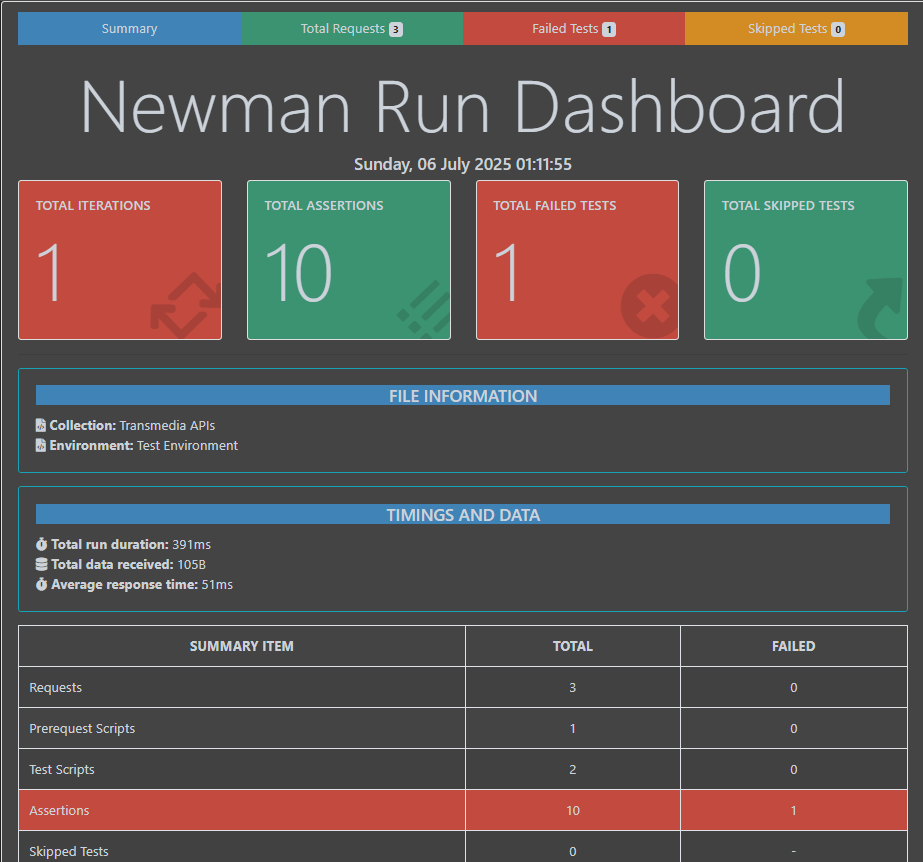

# Transmedia API Automation Test Suite

This repository contains automated API tests for the Transmedia project using **Postman**, executed via **Newman**, and reported using the **htmlextra** reporter.

----------
## 📁 Files Included

-   `Transmedia-APIs.json` — Postman Collection containing all test cases.
-   `Test-Environment.json` — Postman Environment configuration.
-   `README.md` — Guide to run and understand the test suite.
    

----------
## 🧪 Test Scenarios

The API test suite includes:

1.  **Add a new list** — POST `/api/lists`
    
    -   Validates status code
    -   Validates response time
    -   Validates response schema
    -   Checks if the `created` field is today's date
    -   Stores `list_id` for use in later requests
2.  **Delete newly created list** — DELETE `/api/lists/{{list_id}}`
    
    -   Validates deletion response
    -   Verifies that deleting the same list again returns 404 or 400
        

----------

## ▶️ How to Run the Tests

### ✅ Prerequisites

-   [Postman](https://www.postman.com/downloads/) install
    
-   [Node.js](https://nodejs.org/) installed
    
-   Newman CLI installed globally:
    
    ```bash
    npm install -g newman
    ```
-   Report Generator installed globally:
   
      ``` bash
       npm install -g newman-reporter-htmlextra
      ```
### 🚀 Run the Tests with Report Generation

Use the following command to run the tests and generate an HTML report:

    newman run Transmedia-APIs.json -e Test-Environment.json -r htmlextra

This will generate a detailed HTML report (`newman/Transmedia-APIs-report.html` by default).
## 📊 Sample Report Output


The HTML report contains:

-   Execution summary
-   Test case results
-   Response details and assertions
-   Failure trace 
You can open the report in any browser.

----------

## 📌 Notes

-   Make sure the API server is running at the `base_url` defined in the environment (`http://localhost:3000` by default).
    
-   You can change the `base_url` or any environment variable in `Test-Environment.json` or directly in Postman.
    
-   Random data like full names is used using Postman's dynamic variables (`{{$randomFullName}}`).
    

----------

## 👤 Author
Md Sadiquzzaman